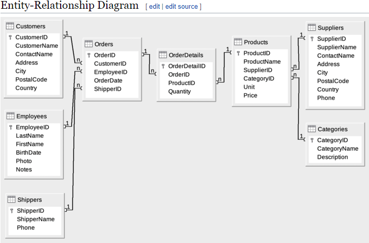

# Database Northwind

Northwind Traders is a database sample that is shipped along with the Microsoft Access application. The Northwind database is available under a Microsoft Public License.

https://en.wikiversity.org/wiki/Database_Examples/Northwind

